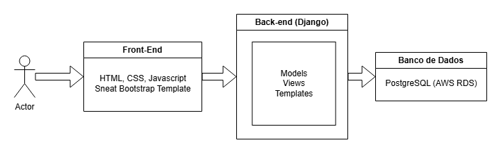
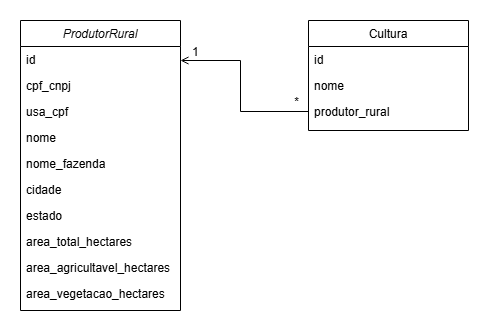

# Documentação do Projeto

## Visão Geral

Este projeto Django é voltado para um teste técnico do Serasa e inclui uma aplicação web que gerencia produtores rurais. O projeto possui funcionalidades para visualizar e gerenciar informações sobre produtores e suas respectivas culturas.

- Para utilizar a aplicação: `http://3.142.140.39/`

- Documentação da API: `http://3.142.140.39/api/swagger/`

## Arquitetura

Para esse projeto, a descrição do teste técnico solicitava o uso de React e Node.js. No entanto, a recrutadora explicou que se tratava de um teste geral e que eu poderia utilizar a stack de minha preferência. Portanto, optei por utilizar as tecnologias com as quais estou mais familiarizado e que também fazem parte da descrição original da vaga: banco de dados PostgreSQL, gerenciado pelo AWS RDS, back-end em Django, e front-end em HTML/CSS/JavaScript com a template Bootstrap Sneat. Para a hospedagem, está sendo utilizada uma instância EC2 da AWS, com sistema Amazon Linux, e o projeto está containerizado com o Docker.

### Diagrama de Componentes



### Diagrama de Classes



## Estrutura do Projeto

- **`brain_agriculture/`**: Diretório principal do projeto Django.
  - **`settings.py`**: Arquivo de configuração principal do Django.
  - **`urls.py`**: Arquivo de roteamento global do projeto.
- **`api/`**: Código da API do projeto.
  - **`urls.py`**: Roteamento global das URLs da API.
  - **`dashboard/`**: Aplicativo que fornece os dados para o dashboard da página inicial da interface de usuário.
    - **`views.py`**: Lógica e requisitos de negócio para o dashboard.
    - **`tests.py`**: Testes das endpoints relacionadas ao dashboard.
  - **`produtor_rural/`**: Aplicativo que gerencia o modelo de Produtor Rural.
    - **`models.py`**: Definição do modelo.
    - **`views.py`**: Lógica e requisitos de negócio para o produtor rural.
    - **`tests.py`**: Testes das endpoints relacionadas ao produtor rural.
    - **`urls.py`**: Mapeamento das URLs relacionadas ao produtor rural
- **`frontend/`**: Código relacionado à interface do usuário e à renderização das páginas da aplicação
  - **`views.py`**: Contém as views que gerenciam a lógica de renderização das páginas HTML que compõem a interface do usuário.
  - **`urls.py`**: Define o mapeamento de URLs que apontam para as views do frontend.
  - **`templates/`**: Arquivos HTML.
  - **`static/`**: Arquivos estáticos (CSS, JavaScript).
  
- **`Dockerfile`**: Define a imagem Docker para a aplicação.
- **`docker-compose.yml`**: Configuração para orquestrar containers Docker.
- **`.env`**: Variáveis de ambiente para configuração do Django e do banco de dados.
- **`run.sh`**: Script para iniciar os containers Docker.
- **`requirements.txt`**: Lista de dependências Python do projeto.

## Configuração do Banco de Dados

### **Opção 1: Usando o PostgreSQL**
   - Atualize o arquivo `.env` com as credenciais do banco de dados:

     ```
     DB_NAME=
     DB_USER=
     DB_PASSWORD=
     DB_HOST=
     DB_PORT=
     ```

### **Opção 2: Usando o SQLite**
   - Caso você não possua credenciais para um banco de dados PostgreSQL, mude o valor da variável `POSTGRESQL` em `settings.py` para `False`

     ```python
     POSTGRESQL = False
     ```

## Executando a aplicação

### Opção 1: run.sh

O `run.sh` é um script para iniciar os containers Docker facilmente

- Torne o script `run.sh` executável (necessário apenas uma vez):

```bash
chmod +x run.sh
```

- Após isso basta executar o script.

```bash
sudo ./run.sh
```

### Opção 2: Comandos Docker

```bash
sudo docker-compose build
sudo docker-compose up -d
```

Após isso seu projeto estará disponível em `http://127.0.0.1:8000`


### Execução dos Testes

Se não tiver instalado os módulos necessários para a execução do projeto localmente, execute no terminal:

```bash
pip install -r requirements.txt
```


Para executar os testes unitários na API do projeto:

```bash
python3 manage.py test
```

## Criando Dados Mockados

O projeto disponibiliza um script em python para geração de dados aleatórios e realistas.

- Com o projeto rodando na porta 8000, basta executar:

```bash
python3 dados_mockados.py
```